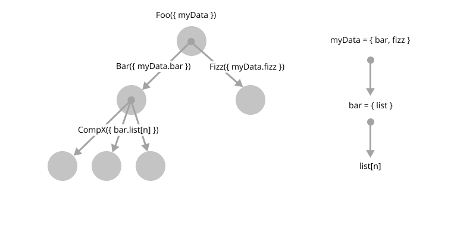

_Do we need state management libraries?_

Managing application state is one of the hardest parts of writing an application. It's often the first created component of any application, but tends to suffer from application growth. How exactly do you plan for managing application state in a huge code base, when you made decisions early on.

When it comes to state manage in [React][react] applications, there's a seemingly never ending discussion on the right approach. Do we go with [Redux][redux], work with the boilerplate code and embrace the additional complexity, consider [MobX][mobx] but shift to an imperative approach using an object-oriented pattern. Or do we stick with React and use the in-built functions, like hooks and Context API to manage our state.

Both approaches suffer when your application grows, and neither are interchangeable, given their contrasting approaches. This is when React state hooks and the Context API are introduced, and as advocates will tell you, it's just easier to handle state using React.

There are plenty of alternatives to using redux, but none really address the core issue of state management; how do you manage application state as the application grows? One of the reasons why Redux has been so popular, is because it solves the problem of prop drilling, that intricately links components through dependencies of data.



The issue with redux-like libraries is that components and data are inexorably linked; components are dependent on redux and cannot take updates from the redux stores, without being redux components. This tight coupling is a choice that _has_ to be made at the start of the project. Libraries like MobX are more flexible in their approach, but you still have the issue of state-to-component coupling, it's unavoidable.

### What about using React to manage our state?

Utilising the Context API allows us to pull in state as we need it, perform necessary operations and then commit our changes. Any components that depend on that context, with that data scope, will automatically receive the updates. Sounds great right? Well, here's the kicker. Context API can be used to manage application state, but how do you manage the scope? It typically ends up being prop-drilling shifted elsewhere, more often than not, in the Contexts.

That's not to say you shouldn't use the Context API to manage application state, quite the opposite. You _should_ use it to _help_ manage application state, but as a means to inject application state where it's required. Using Context API to specifically _manage_ your application state, is marginally better than prop drilling. At some point, somewhere in your application, contexts can and often do, get linked.


We can combine `useState` with the Context API, use deferred actions like `useEffect`, `useMemo` and other hook functions, or the equivalent functions with class components, to achieve a very-React way of doing things. But, how do we know what the state of our Context APIs are, or which ones we need to import, or which ones we need to update? How about asynchronous actions, race conditions, immutability? We don't get a history of changes, unless we manage that ourselves.

Context API and React hooks _don't_ solve this issue, which is what libraries like Redux attempted to solve in the first place. Which brings us full circle: React prop drilling (React) → Redux/MobX (Lib) → Context APIs and hooks (React).

### Why use Redux or MobX?

One of the benefits that Redux brings is the approach to decouple of the state from the component. The side effect of that effort, is that state management is far more abstract than providing a simple API, or even using dereferencing (MobX) to directly interact with application state. 


How often have you heard a developer say they would rather work with Redux, [sagas][redux-saga], [epics][redux-epics], middlewares and actions, over a direct approach like MobX or the Context API? Dereferencing is the far more understandable approach, certainly for developers learning how to manage application state. You lose a lot of what Redux provides you, but you also do away with an extraordinary amount of boilerplate code and complexity.

Demo time, let's compare the pair!

We'll create our context first, this is the same for all approaches except Redux which bundles its own Context provider:

```javascript
// Context API
const { createContext, useContext } = require("react");

const StateContext = createContext({});
const useStateContext = () => useContext(StateContext);
const StateProvider = StateContext.Provider;
```

Let's use the Context API approach:
```javascript
const Foo = () => {
  const { foo } = useStateContext();
  return <div>Foo: {foo}</div>;
}

ReactDOM.render(
  <StateProvider value={{foo: "bar"}}>
    <Foo />
  </StateProvider>
  , document.getElementById("main")
)
```

Let's take a look at the approach with MobX:
```javascript
// MobX
import { observer } from "mobx-react";
import { observable } from "mobx"

const Foo = observer(() => {
  const { foo } = useStateContext();
  return <div>Foo: {foo}</div>;
});

const data = observable({
  foo: "bar"
});

ReactDOM.render(
  <StateProvider value={data}>
    <Foo />
  </StateProvider>
  , document.getElementById("main")
)
```

Now let's look at Redux (notice how we _don't_ use the Context that we've created, [follow the guide here][redux-react-tutorial]):
```javascript
import { Provider, connect } from "react-redux";
import { createStore, combineReducers } from "redux";

const initialState = {
  foo: "bar"
};

const store = createStore(
  combineReducers(
    (state = initialState, action) => {
      switch(action.type) {
        case "SET_FOO": {
          const { foo } = action.payload;
          return {
            ...state,
            foo: foo
          }
        }
        default:
          return state;
      }
    }
  )
);

const Foo = ({foo}) => <div>Foo: {foo}</div>;

const mapStateToProps = state => {
  const { foo } = state;
  return { foo };
}

const ConnectedFoo = connect(mapStateToProps)(Foo);

ReactDOM.render(
  <Provider store={store}>
    <ConnectedFoo />
  </Provider>
  , document.getElementById("main")
)
```

It takes _3 times as much code_ to integrate Redux with your application, and you _have_ to dispatch mutation events to store changes.

### Is RxJS a viable option?

All of the above options are enough to make anyone's head spin, which brings us to [RxJS][rxjs], and using the asynchronous tools to manage state.

I'm not going to tell you that it's easy, or that it's a simpler approach to state management in React, because it isn't. For the complexity it adds, the benefits you get are far more advantageous than some of the options above.

Let's have a look at [the example application][rxjs-repo] that I've created on GitHub and discuss some of the approaches taken towards managing state. 

In general, the example application covers:
* Immutability
* Historical state
* Querying
* Observing and responding to state changes
* Using reducers to dispatch state changes

The state management is influenced by Redux and the ideas of stores; data is logically stored in data blocks, prefixed with a store name, eg. `"TODOS"`. You can fetch the state management object data at any time that you need through the Context API, and query the data in stores through the method `getStore()`. 

The API function `getStore` takes two inputs - the store name and the query path, a period-concatenated string of object literals, as well as an array filter function:

```javascript
// Object querying
getStore("TODOS", "items");

// Array filtering
getStore("TODOS", "items.completed#1"); // returns [{}, ...]

// completed#1 is transformed to: field[completed], value[1]
```

If no value is present on the query path, `undefined` is returned. If an array filter is passed, and no array exists, `undefined` is also returned. When you filter on an array, if the value is an object, it will attempt to match the key/value against the field/value pair for each entry, or if the array value is not an object, it will attempt to match the entry value against the query value.

```javascript
const items = [
  { completed: true },
  { completed: 1 },
  { completed: "1"}
  "1",
  1
];

getStore("TODO", "items.completed#1");

// Process:
items.filter(val => {
  if (val is object) {
    return val[field] === value;
  }

  return val === value
});

// Expected items: 5
```

Unlike MobX where dereferencing data in an observing object provides obserable behaviour on mutation or assignment, like Redux, the user needs to fire off an update event. You create a reducer that responds to update events, and then update the state dependent on that call. Where RxJS shines is that an event is an arbitraty event, you can opt to send data with the event, so that observers can instantly consume the new state without querying the store:

```javascript
const [ item, setItem ] = useState(undefined);
// Register
registerStoreReducer("TODOS", event => {
  if (event.action === "SET.ITEM") {
    // Code to update store
    notifyObservers(event.store, "UPDATE", state.getStore("TODOS"));
  }
})

// Consume
subscribeOnStore("TODOS", "SET.ITEM")
  .subscribe(event => {
    setItem(event.data);
  })

// Update
if (!item) {
  notifyObservers("TODOS", "SET.ITEM", { completed: false, id: 1 });
}
```

To load this approach into our application, we need to:
1. Initialise our RxJS state container
2. Create a store
3. Register reducers

```javascript
const state = initialiseState();
registerReducers(state);
state.setState("TODOS.items", []);

ReactDOM.render(
  <StateProvider value={state}>
    <TodoList />
  </StateProvider>
  , document.getElementById("main")
)
```

The benefit of this approach over Redux is that we leverage the flexibility Context API, to inject different streams of data whever we need it, while adding rich functionality on top of it, but _never_ replacing it. 

Let's say you have a user management state object on top of your todos. This isn't something you want to risk leaking into your wider application, so you would want to separate the state. Using the RxJS approach above, you would initialise a new state container and provide that through the Context API.


### Conclusion

Like Redux, there is boilerplate code to get going, but the one thing we're not doing with our code, is creating higher-order components to inject store data as props into our components. That approach is useful and often very helpful, but that should be a separate, opt-in approach.

The benefit that you do get with RxJS is simplicity over complexity. It's not as easy to use as the Context API or MobX, but you know through the naming conventions of the state utility functions, what happens where. Combining the observers with `useEffect` would be ideal, so that you can subscribe/unsubscribe as the data changes, but more importantly, unsubscribe from all store subscriptions when the component unloads.

This sample application is not intended for production use; it's a proof of concept to prove that an observable approach is possible, accessible and should be considered a viable alternative.

[redux]: https://github.com/reduxjs/redux
[mobx]: https://github.com/mobxjs/mobx
[rxjs]: https://github.com/ReactiveX/rxjs
[react]: https://github.com/facebook/react
[redux-saga]: https://redux-saga.js.org/
[redux-epics]: https://redux-observable.js.org/docs/basics/Epics.html
[redux-react-tutorial]: https://react-redux.js.org/introduction/basic-tutorial
[rxjs-repo]: https://github.com/jmitchell38488/react-rxjs-state-example