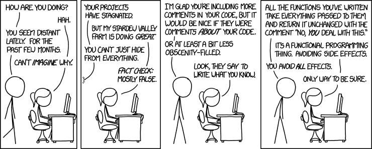

What are side effects? It's one of those questions that gets frequently asked on Stack Overflow, around the
water cooler and in interviews, but what does it mean? How do you know if your code or function has a side effect? 

You may have even come across the functional programming afficinado, who has claimed that no side effect code will
save the day, and it's what functional programming is the bees knees for. I'll let you in on a little known secret - 
object-oriented programming can also be developed without side effects; the side effects advice applies equally to both
paradigms.
 
Functional programming has become hot topic in the JavaScript world, with large code bases making heavy use of
declarative paradigm ideas, while practitioners have campaigned for wider adoption.
 
Functional programming is the process of building applications, composing it primarily of pure functions, avoiding
shared state, mutations on data and side effects. It is [declarative][p-declarative] rather than
[imperative][p-imperative], and application state flows from one function to the next.

### tl;dr
Functional programming goes someway towards reducing the impact of side effects in code that follows an imperative
paradigm. Side effects are not only limited to state manipulation, interacting with the I/O, database, log system, 
APIs and anything else that can be controlled, has a side effect.

Some side effects are beneficial, and desired, such as the `setTimeout()` function, equivalent to `sleep()` and `wait()`
in multi-threaded applications. Side effects aren't a bad thing, but when hidden, or not otherwise obvious what's
happening, they can be dangerous.

Functional programming is not the panacea, but it is a good option, and should be combined with good application design
and development practices.

### Breaking it down
A side effect is the modification of state through the invocation of a function or expression. In order for a
function or expression to have a side effect, the state it modifies should be out of its local scope. Such as
passing an object by reference through functions to be mutated and performing I/O operations.

The presence of side effects in code is neither a good or bad thing. They are inevitable in some cases, such as when
working with languages that follow the imperative programming paradigm, or when mutating state through necessity.

In functional programming, functions are often designed to avoid side effects, with the result of most function calls
being a derived value from the input parameters. The lack of side effects makes it easier to do formal verifications,
and tends to lean towards an easier method of testing.
 


### Shared state
A shared state is any kind of shared state, an object, variable or memory space, that exists in a shared scope, such
as closures, classes, functions and even global scopes, or as the input property being passed through functions.
 
The problem with shared state is by virtue its shared nature; you need to know the history of the object, shared
events and other potential points of mutation and interaction.
 
A common side effect of shared state are race conditions. For example, imagine you have a `User` object, with a
function `saveUser()`, which makes a request to an API. While that process is happening, the user modifies their
profile and saves their data again, thus calling `saveUser()` a second time. Unfortunately for the user, the second
request was received, processed, and their record updated before the first one completed.
   

 
When working with shared state, there are strategies to mitigate collisions, races and deadlocks.

Another problem with shared state is the cascading function problem, in which the order and even timing of function
calls has to be changed as the state changes. This is typically a side effect of changing the order of functions
calls, which causes a cascade of errors.

```javascript
const state = {
  myVal: 1
};

const doSomething = () => state.myVal += 1;
const handleSomeEvent = () => state.myVal +=2;

doSomething(); // state.myVal = 2;
switch (state.myVal) {
  case 2:
    handleSomeEvent(); // state.myVal = 4;
    break;
}

console.log(state) // { myVal: 4 }
```  

If we don't call `doSomehing()` before our switch statement, `handleSomeEvent()` doesn't even get called, and the
same thing happens when the invocation of `doSomething()` is shifted _after_ the switch statement.
 
```javascript
const state = {
  myVal: 1
};

const doSomething = () => state.myVal += 1;
const handleSomeEvent = () => state.myVal +=2;

switch (state.myVal) {
  case 2:
    handleSomeEvent(); // never gets called
    break;
}

doSomething(); // state.myVal = 2;

console.log(state) // { myVal: 2 }
``` 

Introducing pure functions following the functional programming paradigm helps us avoid shared state, thus avoiding
issues such as cascading function errors, potential race conditions, and situations where state is stale.

```javascript
const state = {
  myVal: 1
}

const f = (state) => ({ ...state, ...{ myVal: state.myVal + 1}});
const g = (state) => ({ ...state, ...{ myVal: state.myVal + 2}});

const newState = f(state);
console.log(state); // { myVal: 1 }
console.log(newState); // { myVal: 2}

const finalState = g(f(state));
console.log(state); // { myVal: 1 }
console.log(finalState); // { myVal: 4 }
```
[Check it out on codepen][cpen-pf].

In the example above, using the object spread, we're able to _copy_ the values of the input onto our output state, 
while performing the mutations to the new object that we need, rather than mutating the values of `state` directly. 
This is a common pattern in JavaScript for copying values in one object into another, such as setting default values.

The order of function calls still matter, as the result can change depending in which order you call the functions in. 
The function composition (taking two functions to produce a single function) of `f` and `g` → `f(g(x))` does not
always equal to composition of `g(f(x))`. In our example above it does, but what if `g` performs a multiplication
rather than an addition? `f(g(x)) ≠ g(f(x))`.

### Immutability
An immutable object is an object that can't be modified after creation, through manipulation of a property, or
through assignment. A mutable object is an object which can be modified.
 
Immutability and data flow is a central concept in functional programming. In JavaScript, it's important not to
confuse the keyword `const` with immutability; `const` declares a variable that cannot be reassigned after it has
been created. 
 
You can't create immutable objects in JavaScript by default. While `const` prevents value reassignments, you can
still change the properties and values of objects and arrays, assigned to `const`, `let` and `var`.
 
However, immutable objects can still be achieved in JavaScript by using the [Object.freeze][obj-freeze], which
prevents the modification of the object one-level deep, thus making it partially immutable.
 
```javascript
const state = Object.freeze({
  myVal: 1
});

state.myVal = 2;
console.log(state.myVal); // 1

const myObj = Object.freeze({
  nested: { myVal: 1}
});

myObj.nested.myVal = 2;
console.log(myObj.nested.myVal); // 2
```

Frozen objects are only superficially frozen; to achieve immutable objects, you will need to deep-freeze the object, 
by recursively calling `Object.freeze` over all properties in the object, from the deepest child and work your way up.

Thera are several libraries in JavaScript that provide [trie data structure][tries]-like behaviour with immutable
stores, such as [immutable.js][immutable.js] and [mori][mori.js].

### Idempotency - lets get mathematic!

Contrary to what some may suggest, a side effect isn't a bad thing. It does not have to be hidden or unexpected
behaviour. It also has nothing to do with [idempotency][idempotency] in computer science - an idempotent function
can have side effects, while a non-idempotent function may have no side effects.
 
A function (or subroutine) is considered idempotent in computer science when:
* In imperative programming, the system state remains the same after one or more invocations of a function 
(or subroutine) with side effects,
* A pure function in functional programming,
* A function is idempotent in the mathematical sense
  
A function `f()` with side effects is idempotent under sequential composition `f; f` if, when called n-times with the
same list of arguments, the nth call has no side effects, and returns the same value as the first invocation, 
assuming no other procedures were called.
 
```javascript
// Idempotent function
var x = 0;
function f(n) {
  x = n;
}

f(5); // x = 5
f(5); // x = 5
f(5); // x = 5
```

A typical example of an idempotent function, is a function that queries a database for a customer's name and address.

### The influence of functional programming

There is a growing ground swell from functional programming enthusiasts, that advocate for less side effect
driven code. There could also be confusion between side effects and [pure functions][pfunction] - a function that is
(a) idempotent, (b) has no side effects, and (c) will return the same output for the same parameters, every time.
  
```javascript
// pure function
function f() {
  let x = 0;
  return ++x;
}
```

Although the code sample above does not look like it is pure, it actually is. The value of `x` can only be observed
in other invocations of `f()`, and `f()` does not communicate or cache the value of `x` to its environment.
 
A function is not pure and has no side effects, if the result of the invocation of the function is different
each time without modifying state.

```javascript
// non-pure function  
function z() {
  let x = Math.random() * 100;
  return ++x;
}
```

A function is both not pure and has side effects if during the invocation, it modifies state. This can be state that
is passed to it as an input parameter, or state that it can access through its closure scope.
 
```javascript
let counter = 1;
function increment() {
  ++counter;
}
increment(); // counter is now 2

let val = 2;
function square(x) {
  return x *= x;
}
square(2); // val = 4
```

While classes colocate functionality and bound together under the namespace of the object class, functional programming
tends to reuse a collection of functional utilities to process data. 

Typically in functional programming, any type of data is fair game. For example, being able to use the `map` utility
function to map over objects, strings, arrays and other data types. This is achieved by using **higher-order
functions**, which is a function that takes a function as an argument, returns a function, or both.

JavaScript has **first class functions**, which allows us to treat functions as data and assign them to variables, 
pass them as arguments, return them from other function calls, etc.

### So it's not all bad?
So far we've covered what happens when a function assigns a new value to a variable, or looks like a pure function, 
but may not be one. Other side effects can happen when a function call invokes another function.

In multi-threaded applications, pausing a thread is a side effect. The state of the application has been modified in
some way, and in some cases functions like `sleep()` or `wait()` are only useful for their side effects.
 
The term side effect may sound negative, but normally effect of calling a function is the very purpose of the
function itself. In some way there is a side effect, be it memory or cpu utilisation, storing data to a database, 
creating a system log, communicating with a message bus server, etc.
  
In mathematics, the function is a mapping from a tuple of values (input) to a single value (output). So, given
function `f` and a value `x`, `f(x)` will always yield the same result `y`. This is the basis of the pure function, 
but is often different to what the concept of a function (procedure) is in many programming languages, which is more
of a construct.

Given the mathematical nature of what a function is, and how that differs in programming languages, there's bound to
be side effects in the invocation of any function, just that most of those are abstracted away from us, so that we
don't know about it.

### Conclusion
  
There are instances though when following the declarative programming paradigm, that creating pure functions is a
cleaner, safer and an easier way to develop. JavaScript has made great strides towards incorporating functional
programming ideas into many of its languages features since ES2015, such as with the `Array.*` functions.
 
The negative aspect of side effects normally comes from cases where side effects are hidden or unknown. This is bad
programming in the first place and should be avoided at all costs. Any code that produces a side effect should make
it clear that it is doing so. Even Haskell, one of the most popular functional programming languages, still allowed
I/O operations.
   
Statelessness is one approach to avoiding side effects, but that only takes into considering that state is cached and
stored inside the application. Often this isn't the case, such as with RESTful APIs, or Web UIs that don't cache data
locally.

In general, most applications will combined the declarative and imperative programming paradigms. There's a fine
balancing act between the declarative (what do to) and imperative (how to do) paradigms, with more a shift in the
community towards declarative programming.

Practicing good software design principles, adopting declarative coding paradigm where necessary, and utilising
immutable objects is a solid step in the right direction. 


[mori.js]: https://swannodette.github.io/mori/
[immutable.js]: https://immutable-js.github.io/immutable-js/ 
[tries]: https://en.wikipedia.org/wiki/Trie
[p-declarative]: https://en.wikipedia.org/wiki/Declarative_programming
[p-imperative]: https://en.wikipedia.org/wiki/Imperative_programming
[obj-freeze]: https://developer.mozilla.org/en-US/docs/Web/JavaScript/Reference/Global_Objects/Object/freeze
[cpen-pf]: https://codepen.io/jmitchell38488/pen/NWNJrzz
[idempotency]: https://en.wikipedia.org/wiki/Idempotence#Computer_science_meaning
[pfunction]: https://en.wikipedia.org/wiki/Pure_function

